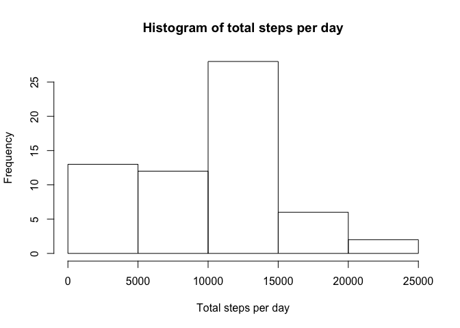

# Reproducible Research: Peer Assessment 1

## Loading and preprocessing the data

```r
if (!(c("activity.csv") %in% list.files())) 
    stop("This script must be run from the directory that contains activity.csv")

if (!require(dplyr)) stop("This script requires dplyr to be installed")
if (!require(ggplot2)) stop("This script requires ggplot to be installed")
if (!require(data.table)) stop("This script requires data.table to be installed")

data <- read.csv("activity.csv")
```
## What is mean total number of steps taken per day?

```r
total_steps <- data %>%
    group_by(date) %>%
    summarise(total = sum(steps, na.rm = T))

hist(total_steps$total,
     main = "Histogram of total steps per day",
     xlab = "Total steps per day")
```

 

```r
mea <- mean(total_steps$total)
med <- median(total_steps$total)
```
The mean number of steps taken per day is 9354.2295082.
The median number of steps taken per day is 10395. 

## What is the average daily activity pattern?

```r
five_min_average <- data %>%
    group_by(interval) %>%
    summarise(mean(steps, na.rm = T))
plot(five_min_average,
     type = "l",
     main = "Average steps taken per five minute interval in a day",
     xlab = "Five minute interval number in a 24 hour day",
     ylab = "Average number of steps")
```

 

```r
maximum <- which.max(five_min_average$`mean(steps, na.rm = T)`)
```

The 5 minute interval with the maximum average number of steps taken is 104.

## Imputing missing values

```r
cnt <- filter(data, is.na(steps))
dt <- data.table(data)
dt[is.na(steps), steps := five_min_average[, 2]]
```

```
##        steps       date interval
##     1:     1 2012-10-01        0
##     2:     0 2012-10-01        5
##     3:     0 2012-10-01       10
##     4:     0 2012-10-01       15
##     5:     0 2012-10-01       20
##    ---                          
## 17564:     4 2012-11-30     2335
## 17565:     3 2012-11-30     2340
## 17566:     0 2012-11-30     2345
## 17567:     0 2012-11-30     2350
## 17568:     1 2012-11-30     2355
```

```r
total_nona_steps <- dt %>%
    group_by(date) %>%
    summarise(total = sum(steps))
hist(total_nona_steps$total,
     main = "Histogram of total steps per day (NAs imputed)",
     xlab = "Total steps per day")
```

 

```r
mea_nona <- mean(total_nona_steps$total)
med_nona <- median(total_nona_steps$total)
```
The mean number of steps (na removed) taken per day is 1.074977\times 10^{4}.
The median number of steps (na removed taken per day is 10641. 

This shows that with na removed, the mean steps and median steps are lower than when the na's are replaced with mean five minute interval steps.

## Are there differences in activity patterns between weekdays and weekends?

```r
dt[weekdays(as.Date(dt$date)) %in% c('Saturday', 'Sunday'),
   dayofweek := factor("weekend")]
```

```
##        steps       date interval dayofweek
##     1:     1 2012-10-01        0        NA
##     2:     0 2012-10-01        5        NA
##     3:     0 2012-10-01       10        NA
##     4:     0 2012-10-01       15        NA
##     5:     0 2012-10-01       20        NA
##    ---                                    
## 17564:     4 2012-11-30     2335        NA
## 17565:     3 2012-11-30     2340        NA
## 17566:     0 2012-11-30     2345        NA
## 17567:     0 2012-11-30     2350        NA
## 17568:     1 2012-11-30     2355        NA
```

```r
dt[is.na(dayofweek), dayofweek := factor("weekday")]
```

```
##        steps       date interval dayofweek
##     1:     1 2012-10-01        0   weekday
##     2:     0 2012-10-01        5   weekday
##     3:     0 2012-10-01       10   weekday
##     4:     0 2012-10-01       15   weekday
##     5:     0 2012-10-01       20   weekday
##    ---                                    
## 17564:     4 2012-11-30     2335   weekday
## 17565:     3 2012-11-30     2340   weekday
## 17566:     0 2012-11-30     2345   weekday
## 17567:     0 2012-11-30     2350   weekday
## 17568:     1 2012-11-30     2355   weekday
```

```r
five_min_average_day_of_week <- dt %>%
    group_by(dayofweek, interval) %>%
    summarise(mean = mean(steps))

plot <- ggplot(five_min_average_day_of_week, 
               aes(interval, mean)) + 
    geom_line() +
    facet_grid(dayofweek ~ .) +
    labs(list(title = "Average steps taken per 5 min interval",
              x = "Interval", 
              y = "Average number of steps"))
print(plot)
```

 
